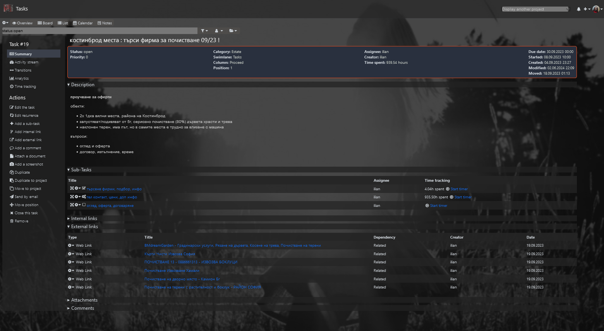

<h1 name="user-content-readme-top" align="center">DarkTransparent theme for Kanboard</h1>

<p align="center">
    <a href="https://github.com/kanboard/kanboard" title="Kanboard - Kanban Project Management Software">
        
    </a>
</p>
<p align="center">
    <a href="https://github.com/imfx77/kanboard-theme-DarkTransparent/blob/master/LICENSE" title="Read License">
        
    </a>
    <a href="https://github.com/imfx77/kanboard-theme-DarkTransparent/stargazers" title="View Stargazers">
        
    </a>
    <a href="https://github.com/imfx77/kanboard-theme-DarkTransparent/discussions">
        
    </a>
</p>

---

This is a dark transparent material theme, with dynamically reloading non-moveable background image.
It is intended for use with the [Customizer plugin](https://github.com/creecros/Customizer) for [Kanboard](https://github.com/kanboard/kanboard).

⚠️ **DISCLAIMER !**  
The theme mostly presents customizations to `my own liking` and is distributed **AS IS**.  
So please, review the description and screenshots below, and consider using it or not for yourself !

✅ And if you actually like it and use it, then please, give a ⭐ to this repository !

## Compatibility

- Requires [Kanboard](https://github.com/kanboard/kanboard "Kanboard - Kanban Project Management Software") ≥`1.2.33`
- Requires [Customizer plugin](https://github.com/creecros/Customizer) for Kanboard ≥`1.14.2`

## Features

The theme is a modified version of the [Galaxy.css](https://github.com/creecros/Customizer/blob/master/Assets/css/themes/Galaxy.css)
from the `Customizer plugin` (which in turn is a modification of the [nebula.css](https://github.com/kenlog/Nebula/blob/master/Assets/css/nebula.css)).

Apart from the obvious changes of the primary highlight color (from `lime green` to `dimmed blue`),
the more subtle, yet significant, differences to the `Galaxy.css` as base comparison are listed hereby:

- there is a non-movable `background image`, which is dark greyscale and semi-transparent
  - a `@media` override is provided for `orientation`, so that the image would show decently on mobile devices in `portrait mode`
  - ⚠️the background image changes on each page reload !    
  - it's been a while since the [Unsplash URL APP](https://source.unsplash.com/random)
doesn't really work, so now using this image source instead
    ```
    https://picsum.photos/1920/1080?grayscale&blur=2
    ```
- the `background color` for all meaningful elements is dark and semi-transparent
- tasks' `background and border colors` are darker shades of their `category color`
- ⚠️ tasks' `priority`, `age`, `dates` and `estimation` are **HIDDEN** !
- ⚠️ tasks' `category label` is moved in the up-right corner, just in left of the `user pic` !
- 🗜️ both the above aim to make the tasks vertically compact (see **Task** in **Screenshots**) !

## Screenshots

Well, the changes described above are much easier to see with examples.  
Please, observe next pairs of screenshots with the `Galaxy` example first, and the `DarkTransparent` example following !

<details><summary><strong>Task Board</strong></summary>

  

</details>

<details><summary><strong>Task List</strong></summary>

  

</details>

<details><summary><strong>Task Details</strong></summary>

  

</details>

<details><summary><strong>Task</strong></summary>

  

</details>

<details><summary><strong>Settings &#10562; Application</strong></summary>

  

</details>

<details><summary><strong>Settings &#10562; Plugins</strong></summary>

  

</details>

<details><summary><strong>Wiki Page</strong></summary>

  

</details>

<details><summary><strong>Todo Notes</strong></summary>

  

</details>

## Installation

- Make sure you have a properly installed `Kanboard` and `Customizer plugin` !
- Download the [DarkTransparent.css](DarkTransparent.css "Dark Transparent theme") theme.
- Go to `Settings` &#10562; `Customizer` &#10562; `Manage Themes` &#10562; `Upload a theme` :
  - (1) `Browse` to the file you just downloaded.  
  - (2) Then `Add Theme`. 
- Now, just above it, in `Manage Themes` &#10562; `Global Themes` :
  - (3) Select the newly uploaded theme from the dropdown.
  - (4) `Save` the settings.
- That's it! Enjoy 🎈


## Authors & Contributors

- [Im[F(x)]](https://github.com/imfx77) - Author
- [Everyone else](https://github.com/creecros/Customizer/graphs/contributors) that made it possible 🙏 

## Credits & References

- [Kanboard](https://github.com/kanboard/kanboard)
- [Customizer plugin](https://github.com/creecros/Customizer)
- [Nebula plugin](https://github.com/kenlog/Nebula)

## License

- This theme is distributed under the [MIT License](LICENSE "Read The MIT license")

<p align="right">[<a href="#user-content-readme-top">&#8593; Top</a>]</p>

---

<p align="center">
    <a href="https://github.com/imfx77/kanboard-theme-DarkTransparent/blob/master/LICENSE" title="Read License">
        
    </a>
    <a href="https://github.com/imfx77/kanboard-theme-DarkTransparent/stargazers" title="View Stargazers">
        
    </a>
    <a href="https://github.com/imfx77/kanboard-theme-DarkTransparent/discussions" title="Read Discussions">
        
    </a>
</p>

<a name="user-content-readme-bottom"></a>
